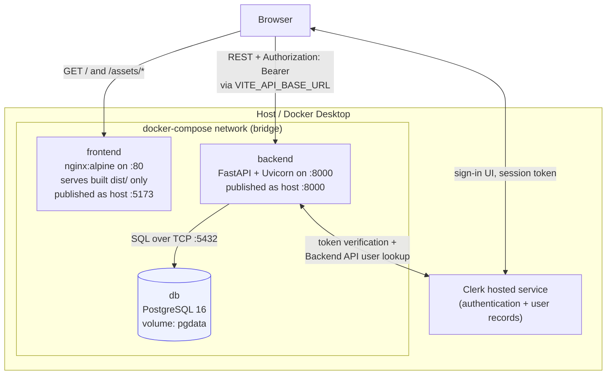
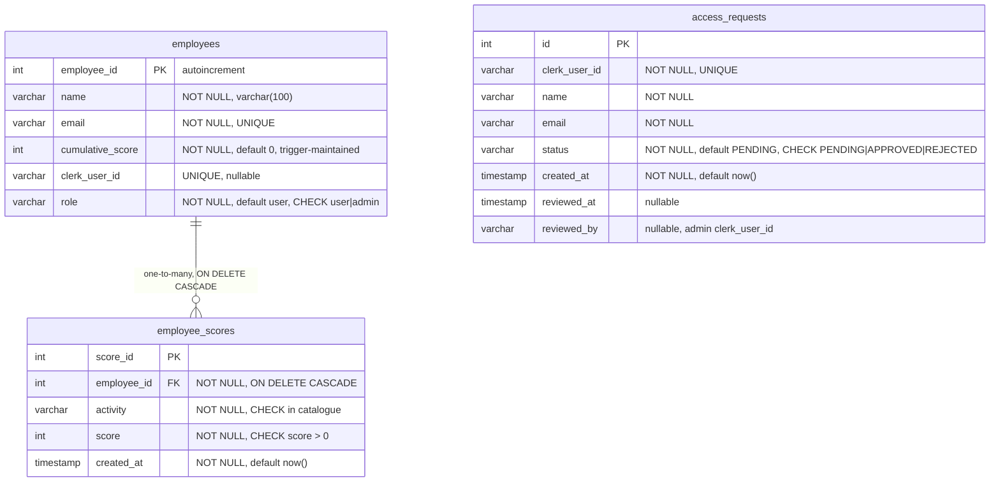
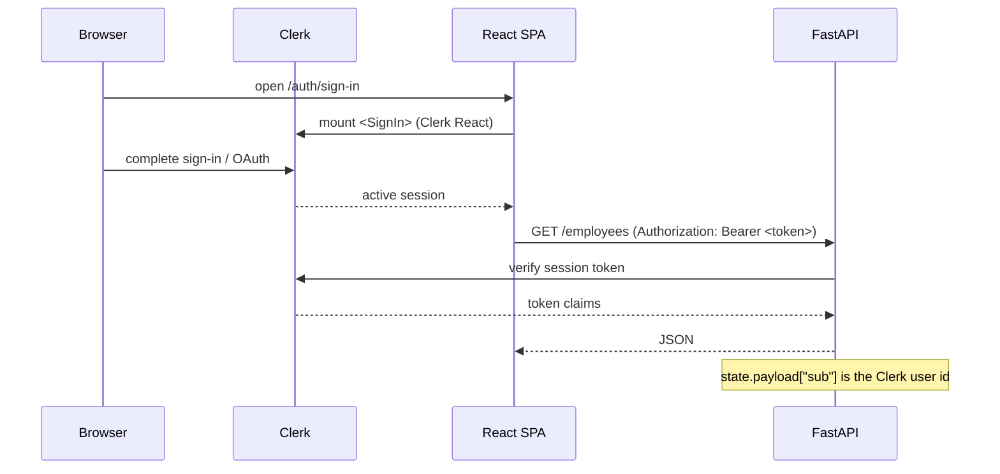

# Employee Leaderboard

> An internal web application that tracks employees, records point-scoring achievements against a fixed activity catalogue, and derives a ranked leaderboard from a database-maintained cumulative score.


| | |
|---|---|
| **Backend package** | `leaderboard-api-project` (`pyproject.toml`) |
| **Repository** | `leaderboard-project` |
| **Frontend package** | `frontend` (Vite) |
| **Auth provider** | Clerk (hosted) |
| **Python / Node** | 3.12+ / ^20.19 or >=22.12 |

---

## Table of Contents

2. [Overview](#2-overview)
3. [Key Capabilities](#3-key-capabilities)
4. [Architecture](#4-architecture)
5. [Technology Stack](#5-technology-stack)
6. [Repository Structure](#6-repository-structure)
7. [Prerequisites](#7-prerequisites)
8. [Environment Configuration](#8-environment-configuration)
9. [Quick Start — Docker](#9-quick-start--docker)
10. [Docker Architecture](#10-docker-architecture)
11. [Dockerfile Explanation](#11-dockerfile-explanation)
12. [Nginx Configuration](#12-nginx-configuration)
13. [Database Design](#13-database-design)
14. [Cumulative Score Logic](#14-cumulative-score-logic)
15. [Leaderboard Logic](#15-leaderboard-logic)
16. [Activity / Achievement System](#16-activity--achievement-system)
17. [Authentication](#17-authentication)
18. [Access Control](#18-access-control)
19. [API Reference](#19-api-reference)
20. [Swagger / OpenAPI](#20-swagger--openapi)
21. [Frontend Architecture](#21-frontend-architecture)
22. [Local Development Without Docker](#22-local-development-without-docker)
23. [Database Migrations](#23-database-migrations)
24. [Common Docker Commands](#24-common-docker-commands)
25. [Troubleshooting](#25-troubleshooting)
26. [Data Persistence](#26-data-persistence)
27. [Security Considerations](#27-security-considerations)
28. [Development Workflow](#28-development-workflow)
29. [Reset / Clean Environment](#29-reset--clean-environment)
30. [Quick Reference](#30-quick-reference)

---

## 2. Overview

**Employee Leaderboard** is an internal, single-organisation web application used to make contribution visible. Rather than tracking abstract activity, it scores a fixed catalogue of concrete professional contributions — running an interview panel, having an open-source PR merged, publishing a blog post, speaking at a major conference, referring a candidate — and lets those scores accumulate per employee.

**What a score represents.** A score is never typed in by a user. A user selects an *activity* from a closed catalogue; the backend resolves that activity to a fixed point value and writes one `employee_scores` row per selected activity. The individual point value is therefore a property of the catalogue, not of the request. The API exposes no endpoint to edit or delete a score — though the database itself does not forbid it, and the aggregate trigger implements an `UPDATE` branch (see [Section 15](#15-leaderboard-logic)).

**What the leaderboard represents.** Every employee appears exactly once, ordered by `employees.cumulative_score` descending, with a SQL `RANK()` position. The leaderboard is a projection of a stored aggregate — it is not recomputed from score rows on each read.

**Who uses it.**

| Persona | What they do |
|---|---|
| **Employee** (`role = user`) | Signs in with Clerk, views the ranked leaderboard, the podium, per-employee score breakdowns, and the global activity feed. |
| **Admin** (`role = admin`) | Everything an employee can see, plus: review and approve/reject access requests, and record achievements for any employee. |
| **Applicant** | Not automatically admitted. Signing in creates a pending access request; they see a waiting screen until an admin acts. |

**Naming.** The Python distribution is `leaderboard-api-project`. The product name *CloudRaft* appears in the sign-in/sign-up interface copy and as the example auto-approved domain in `.env.example`; it is not the package name.

---

## 3. Key Capabilities

Every item below is implemented in the current tree.

**Public read model**
- Ranked leaderboard of all employees with `RANK()` positions and cumulative totals.
- Podium presentation for the top three, plus a full sortable-style table.
- Per-employee drill-down: the individual score records behind a total, aggregated by activity type.
- Global activity feed, newest first, joined to employee names.
- Dashboard statistics: total employees, total points awarded, total activities completed.

**Achievement recording**
- Catalogue-driven score assignment — the client submits only an activity name.
- Multi-select recording: one submission writes one `employee_scores` row per selected activity.
- Immediate cascade: the stored `cumulative_score` updates in the same transaction as the insert.

**Administration**
- Access-request queue with approve and reject actions.
- Approval creates the `Employee` row and stamps `reviewed_at` / `reviewed_by`.
- Roster browser with search by name or email and live ranks.
- Activity history with free-text search and per-activity-type filter chips.

**Identity and access**
- Clerk-hosted authentication with the flow UI embedded in the app's own screens.
- Three automatic admission rules: configured admin email, configured email domain, or manual approval.
- Role-based admin surface, enforced in the frontend and independently in the backend.

**Platform**
- Alembic-managed schema, including a database trigger that maintains the aggregate.
- Three-service Docker Compose stack with a persistent PostgreSQL volume.
- Multi-stage frontend image: Node build, Nginx runtime.

> **Not implemented in this repository:** automated test suites, CI/CD workflows, rate limiting, pagination on list endpoints, and email notifications. There is no `tests/` directory and no `.github/` directory. Verification is manual, as described in [Development Workflow](#28-development-workflow).

---

## 4. Architecture

The application is three processes. The important structural point is that **the browser talks to the backend directly**, not through Nginx: `VITE_API_BASE_URL` is baked into the frontend bundle at build time and points at the host's port `8000`. Nginx serves static files only.



**Request path in detail**

1. The browser loads `/` from Nginx, which returns `index.html` (see [SPA fallback](#12-nginx-configuration)).
2. The SPA boots, `ClerkProvider` initialises, and the app resolves the signed-in user's application access via `GET /me`.
3. Data calls go straight to `http://localhost:8000`. `src/api/api.js` attaches `Authorization: Bearer <Clerk session token>` when a token is available.
4. FastAPI validates the token through the Clerk backend SDK, executes a SQLModel query, and returns JSON.
5. PostgreSQL stores the rows; the `trg_employee_scores_change` trigger maintains `employees.cumulative_score` inside the writing transaction.

**Where each responsibility lives**

| Concern | Owner |
|---|---|
| Static asset delivery, SPA history fallback | Nginx (frontend container) |
| Authenticated session, UI state, section switching | React SPA |
| Business rules, point assignment, access decisions | FastAPI (`src/`) |
| Point values catalogue | `src/constants.py` (server-authoritative) |
| Relational storage, integrity constraints, aggregate maintenance | PostgreSQL + Alembic |

---

## 5. Technology Stack

| Layer | Technology | Purpose |
|---|---|---|
| Frontend | React 19 + Vite 8 | Single-page application; Vite is the dev server and bundler |
| Frontend styling | Plain CSS (`theme.css`, `redesign.css`, `index.css`, `signin.css`) | Hand-written design system; no CSS framework or preprocessor |
| Frontend icons | `lucide-react` | Icon set |
| Backend | FastAPI 0.142 | ASGI HTTP API |
| ASGI server | Uvicorn 0.54 | Serves the FastAPI app |
| Data validation / settings | Pydantic 2.13 + `pydantic-settings` | Request schemas and `.env`-backed configuration |
| ORM | SQLModel 0.0.47 (on SQLAlchemy) | Table models and typed queries |
| Database driver | `psycopg2-binary` | PostgreSQL connectivity |
| Database | PostgreSQL 16 | Primary datastore |
| Migrations | Alembic 1.20 | Versioned schema, plus raw SQL for the trigger |
| Authentication | Clerk (`@clerk/clerk-react`, `clerk-backend-api` 7.x) | Hosted identity, session tokens, user records |
| Python packaging | `uv` + `uv_build` | Dependency resolution and lockfile (`uv.lock`) |
| Containerisation | Docker + Docker Compose | Three-service stack |
| Web server | Nginx (frontend runtime) | Serves the production `dist/` output |
| Linting | ESLint 10 + `eslint-plugin-react-hooks` | Frontend static checks |

---

## 6. Repository Structure

```text
leaderboard-project/
├── src/                          # FastAPI application package
│   ├── main.py                   # app factory, CORS, router registration  <-- uvicorn target
│   ├── auth.py                   # require_auth / require_admin / get_clerk
│   ├── config.py                 # Pydantic Settings + database_url
│   ├── constants.py              # ActivityType enum + ACTIVITY_POINTS
│   ├── logging_config.py
│   ├── db/
│   │   └── factory.py            # SQLAlchemy engine + get_session dependency
│   ├── models/                   # SQLModel tables
│   │   ├── employee.py
│   │   ├── employee_score.py
│   │   └── access_request.py
│   ├── schemas/                  # Pydantic request/response models
│   │   ├── employee.py
│   │   ├── score.py
│   │   ├── leaderboard.py
│   │   └── access_request.py
│   ├── routes/
│   │   ├── employees.py
│   │   ├── leaderboard.py
│   │   ├── scores.py
│   │   ├── activities.py
│   │   ├── stats.py
│   │   └── access.py             # the only authenticated router
│   ├── utils/initials.js         # stray JS file inside the Python package
│   └── leaderboard_api_project/
│       └── __init__.py           # placeholder main(); not the API entry point
│
├── alembic/
│   ├── env.py                    # builds the DB URL from src.config.settings
│   └── versions/
│       ├── 318a7ba1cd70_baseline.py
│       ├── 8584fc0b7778_add_integrity_constraints.py
│       └── 31e46e76cc14_add_access_requests_and_employee_roles.py
│
├── frontend/
│   ├── src/
│   │   ├── main.jsx              # React root + ClerkProvider
│   │   ├── App.jsx               # auth state machine, access resolution
│   │   ├── api/api.js            # fetch wrapper, token injection
│   │   ├── pages/                # SignIn, SignUp, Waiting, Dashboard, Admin
│   │   ├── components/           # shell, leaderboard, auth, admin/, ui/
│   │   ├── hooks/                # useAuthRoute, useCountUp, usePrefersReducedMotion
│   │   ├── constants/            # activities.js, clerkAppearance.js
│   │   ├── utils/                # format, aggregateScores, constellation, initials
│   │   └── styles/               # theme, redesign, signin, animations
│   ├── Dockerfile                # Node build stage -> Nginx runtime stage
│   ├── nginx.conf
│   ├── .env.example
│   └── package.json
│
├── main.py                        # duplicate of src/main.py (unused)
├── recovery/                      # superseded frontend copies + git reflog dumps
├── Dockerfile                     # backend image
├── docker-compose.yml
├── pyproject.toml
├── uv.lock
├── alembic.ini
├── .env.example
├── .gitignore
└── README.md
```

### Legacy and stray files

These exist in the tree, are not imported by the application, and are safe to ignore. They are listed so a new contributor is not misled by them.

| Path | What it is |
|---|---|
| `main.py` (root) | Copy of `src/main.py` — identical text, differing only in line endings (the root file uses CRLF, `src/main.py` uses LF). The container and all documented commands use `src.main:app`; the root copy is unused. |
| `recovery/` | Superseded `App.jsx` / `App.css` / `LeaderboardTable.jsx` / `Podium.jsx` / `EmployeeDrawer.jsx`, plus `recovered-de.txt` and `recovered-ff.txt`, which are raw `git reflog` output. |
| `ck --no-reflogs --unreachable` | Stray captured `git reflog` output at the repository root. |
| `src/leaderboard_api_project/__init__.py` | Placeholder `main()` that prints a greeting. Referenced by `[project.scripts]` in `pyproject.toml`; it does not start the API. |
| `src/utils/initials.js` | JavaScript file inside the Python package. Unused by the backend. |
| `frontend/README.md` | The unmodified Vite template README. This document is the project README. |
| `frontend/src/styles/animations.css`, `frontend/src/App.css`, `frontend/src/import-ui-polish.css` | Stylesheets that exist but are imported by nothing. They are dead weight, not part of the active design system. |

---

## 7. Prerequisites

| Tool | Version | Why it is needed |
|---|---|---|
| **Git** | any recent | Clone the repository; no other VCS operations are required. |
| **Docker Desktop** | any recent | Runs the `db`, `backend`, and `frontend` services. Required for the Docker workflow. Must be *running*, not just installed. |
| **Docker Compose** | v2 (bundled with Docker Desktop) | The `docker compose` commands in this document are Compose v2 syntax. The `docker-compose` (hyphen) form is legacy and is not used. |
| **Python** | **3.12+** | `pyproject.toml` sets `requires-python = ">=3.12"`; `.python-version` pins `3.12`. A 3.12 virtual environment already exists at `.venv/`. |
| **uv** | 0.12+ | The project's package manager. Resolves dependencies from `uv.lock` and creates the virtualenv. `uv.lock` was generated by uv 0.12.9. |
| **Node.js** | **^20.19 or >=22.12** | Vite 8 declares `engines.node` as `^20.19.0 \|\| >=22.12.0`. Node 22.0–22.11 is **not** sufficient. `frontend/Dockerfile` builds on `node:22-alpine`, which resolves to a recent 22.x and satisfies this. |
| **npm** | ships with Node | Installs frontend dependencies. `frontend/package-lock.json` is committed, so `npm ci` is the reproducible install. |

You only need **Git + Docker Desktop** for the Docker workflow. **uv** and **Node.js** are additionally required for the local, non-Docker workflow and for rebuilding the frontend image on the host.

Check your setup:

```bash
git --version
docker --version
docker compose version
uv --version
node --version
npm --version
```

---

## 8. Environment Configuration

There are **two separate environment files** serving **two separate runtimes**. They are not interchangeable, and mixing them up is the most common setup error.

| File | Read by | When it is used |
|---|---|---|
| `./.env` (repository root) | **Backend** — `pydantic-settings` via `Settings`, and `alembic/env.py` | Running the API or Alembic on the host. **Must sit at the repository root**: `env_file` is the relative path `".env"`, resolved against the current working directory. |
| `./frontend/.env` | **Vite** — only variables prefixed `VITE_` are exposed to the bundle | Running `npm run dev` on the host. |
| `docker-compose.yml` `environment:` / `args:` | Compose itself | Running under Docker. See the note below. |

> **Docker overrides the root `.env` for database settings.** The Compose file hardcodes the `db` container's `POSTGRES_*` values and the backend's `DATABASE_*` values directly, so the `DATABASE_*` entries in your root `.env` are used **only** for host-based runs. The `CLERK_*` and `ALLOWED_*` variables *are* interpolated from the root `.env` into the backend container. Keeping both consistent avoids a confusing "works on host, fails in Docker" split.

### Backend variables (root `.env`)

Template: [`.env.example`](.env.example)

| Variable | Required | Type | Purpose |
|---|---|---|---|
| `DATABASE_HOST` | yes | string | PostgreSQL host. `localhost` on the host, `db` inside Compose. |
| `DATABASE_PORT` | yes | int | PostgreSQL port. |
| `DATABASE_NAME` | yes | string | Database name. Must match the target database. |
| `DATABASE_USER` | yes | string | Database role. |
| `DATABASE_PASSWORD` | yes | string | Password for that role. |
| `ALLOWED_EMAILS` | yes | CSV | Exact email addresses that receive **automatic admin** access. |
| `ALLOWED_EMAIL_DOMAINS` | yes | CSV | Email domains that receive **automatic user** access. |
| `CLERK_SECRET_KEY` | yes | string | Clerk Backend API key. **Backend-only secret.** Used to verify tokens and read user profiles. |
| `CLERK_JWT_KEY` | no | string / PEM | Clerk instance public key. When set, tokens can be verified without a network call to Clerk. |
| `CLERK_AUTHORIZED_PARTIES` | no | CSV | Origins permitted to issue accepted tokens. Accepts a comma-separated list; parsed into a list by a field validator. |

`ALLOWED_EMAILS` and `ALLOWED_EMAIL_DOMAINS` are **access-control configuration**, not secrets, but they decide who can administer the application. Use placeholders in shared setups, for example `ALLOWED_EMAILS=admin@example.com` and `ALLOWED_EMAIL_DOMAINS=team.example.com`.

### Frontend variables (`frontend/.env`)

Template: [`frontend/.env.example`](frontend/.env.example)

| Variable | Required | Purpose |
|---|---|---|
| `VITE_API_BASE_URL` | yes | Base URL the browser uses for API calls. `http://localhost:8000` for local work. Baked into the bundle **at build time**. |
| `VITE_CLERK_PUBLISHABLE_KEY` | yes | Clerk **publishable** key. Safe to ship in client code by design, but still keep it in an untracked file. |

> **The root `.env` is a strict schema — unknown keys are fatal, not ignored.** Vite never reads the root `.env`, so the copy of `VITE_CLERK_PUBLISHABLE_KEY` in `.env.example` is misleading. `Settings` declares no such field, and `pydantic-settings`' `BaseSettings` defaults to `extra="forbid"`, which `src/config.py` does not override. Consequences:
>
> - An **empty** value (`VITE_CLERK_PUBLISHABLE_KEY=`, as shipped in `.env.example`) is discarded and the backend starts normally. This is why `cp .env.example .env` works out of the box.
> - A **non-empty** value makes the backend fail immediately, before serving a single request, with `ValidationError: vite_clerk_publishable_key — Extra inputs are not permitted`.
>
> - The same applies to any other undeclared key added to the root `.env`. The Docker flow is partly shielded — Compose only injects the variables named in the `backend` service's `environment:` block — but the host workflow and Alembic read the root `.env` through `Settings` directly, so an extra key breaks them. `frontend/.env` is the effective place for the Clerk key; see [Step 4](#step-4--supply-the-clerk-key-to-the-frontend-image) for how to feed the containerised build without touching the root `.env`.

### Never commit these

`.gitignore` already excludes `.env` and `frontend/.env`. Keep it that way, and never commit:

- `CLERK_SECRET_KEY` — grants full Backend API access to your Clerk instance.
- `CLERK_JWT_KEY` — public, but keep configuration centralised.
- `DATABASE_PASSWORD` and any other database credentials.
- Production connection strings or deploy credentials.

The `VITE_CLERK_PUBLISHABLE_KEY` is a *publishable* key and is designed to be embedded in client bundles. It is not equivalent to the secret key and cannot be used to call the Clerk Backend API.

---

## 9. Quick Start — Docker

Assumes a fresh clone on Windows, macOS, or Linux with Docker Desktop running.

### Step 1 — Clone

```bash
git clone <your-repository-url> leaderboard-project
cd leaderboard-project
```

### Step 2 — Create the backend environment file

```bash
# macOS / Linux
cp .env.example .env

# Windows PowerShell
Copy-Item .env.example .env
```

Edit `./.env` and set, at minimum:

- the five `DATABASE_*` values (only used for host runs, but keep them valid),
- `CLERK_SECRET_KEY` from your Clerk dashboard → **API Keys**,
- `ALLOWED_EMAILS` with your own admin address,
- `ALLOWED_EMAIL_DOMAINS` with your organisation's domain.

Leave `DATABASE_HOST=localhost` in this file if you also intend to run the backend on the host. Compose sets its own value.

### Step 3 — Create the frontend environment file

```bash
# macOS / Linux
cp frontend/.env.example frontend/.env

# Windows PowerShell
Copy-Item frontend/.env.example frontend/.env
```

Edit `./frontend/.env`:

- `VITE_API_BASE_URL=http://localhost:8000`
- `VITE_CLERK_PUBLISHABLE_KEY=<your Clerk publishable key>`

### Step 4 — Supply the Clerk key to the frontend image

> **Required for the Docker flow, and it needs two edits.** As committed, the Clerk key does not reach the containerised bundle, so `ClerkProvider` initialises with `undefined` and the sign-in screens never appear. Two separate gaps cause this, and both must be closed:
>
> 1. `frontend/Dockerfile` declares only `ARG VITE_API_BASE_URL`. It has **no** `ARG`/`ENV` for `VITE_CLERK_PUBLISHABLE_KEY`, and Docker silently discards build arguments that the Dockerfile does not declare.
> 2. `docker-compose.yml` passes only `VITE_API_BASE_URL` under `services.frontend.build.args`.

**Edit A — `frontend/Dockerfile`.** Declare the key alongside the existing `VITE_API_BASE_URL` pair. The `ARG`/`ENV` lines must come **before** `RUN npm run build`, because that is the step that compiles the bundle:

```dockerfile
ARG VITE_API_BASE_URL
ARG VITE_CLERK_PUBLISHABLE_KEY

ENV VITE_API_BASE_URL=$VITE_API_BASE_URL
ENV VITE_CLERK_PUBLISHABLE_KEY=$VITE_CLERK_PUBLISHABLE_KEY

RUN npm run build
```

**Edit B — `docker-compose.yml`.** Pass the value through. Take it from a **shell variable or your shell profile, not from the root `.env`** — see the warning below:

```yaml
    frontend:
      build:
        context: ./frontend
        dockerfile: Dockerfile
        args:
          VITE_API_BASE_URL: http://localhost:8000
          VITE_CLERK_PUBLISHABLE_KEY: ${VITE_CLERK_PUBLISHABLE_KEY}   # add this line
```

Then export the value and run the build in the same shell, so Compose can interpolate it:

```bash
# macOS / Linux
export VITE_CLERK_PUBLISHABLE_KEY="pk_test_..."

# Windows PowerShell
$env:VITE_CLERK_PUBLISHABLE_KEY = "pk_test_..."
```

> **Do not put this key in the root `.env`.** `Settings` inherits `extra="forbid"` from `pydantic-settings`' `BaseSettings`, so any **non-empty** key it does not declare causes a `ValidationError` the moment anything imports `src.config`:
>
> ```text
> pydantic_core.ValidationError: 1 validation error for Settings
> vite_clerk_publishable_key
>   Extra inputs are not permitted [type=extra_forbidden, ...]
> ```
>
> The shipped `.env.example` contains `VITE_CLERK_PUBLISHABLE_KEY=` with an **empty** value, and an empty value is discarded — which is why `cp .env.example .env` works. Filling that line in is what breaks it.
>
> Note that the blast radius depends on the workflow. In the **Docker** flow the backend is shielded, because Compose only injects the variables explicitly listed in the `backend` service's `environment:` block. The **host** workflow has no such filter: `uv run uvicorn src.main:app` and `uv run alembic …` both load the root `.env` through `Settings`, so a filled-in value breaks the API and the migrations there. See [Section 8](#8-environment-configuration).

Until this is applied, verify the frontend with the host dev server (`npm run dev`, see [Section 22](#22-local-development-without-docker)), which reads `frontend/.env` directly and needs no Docker changes.

### Step 5 — Build and start

```bash
docker compose up -d --build
```

`--build` matters on first run: the frontend image bakes the environment variables into the bundle at build time, so the image must be rebuilt after the `VITE_*` values in `frontend/.env` (or the exported shell variable from [Step 4](#step-4--supply-the-clerk-key-to-the-frontend-image)) are set.

### Step 6 — Apply database migrations

The backend container starts Uvicorn; it does **not** run migrations automatically. On a fresh database, apply them explicitly:

```bash
docker compose exec backend uv run alembic upgrade head
```

Verify what was applied:

```bash
docker compose exec backend uv run alembic current
```

This should report `31e46e76cc14 (head)`. On a completely fresh database Alembic applies the whole chain in one pass and prints a single range line (`<base> -> 31e46e76cc14 (head)`); the individual `Running upgrade …` lines only appear when it has to apply a subset. The command is idempotent, so re-running it on an up-to-date database is a no-op.

### Step 7 — Verify

```bash
docker compose ps
```

All three services should report `Up` / `running`. Confirm the API responds:

```bash
curl http://localhost:8000/
# {"message":"Leaderboard API is running"}
```

### Step 8 — Open the application

| Surface | URL |
|---|---|
| Application (SPA) | <http://localhost:5173> |
| Auth screens | <http://localhost:5173/auth/sign-in>, <http://localhost:5173/auth/sign-up> |
| API root | <http://localhost:8000> |
| Swagger UI | <http://localhost:8000/docs> |
| ReDoc | <http://localhost:8000/redoc> |

Because access is gated, the first sign-in will land on a **waiting screen** unless your address matches `ALLOWED_EMAILS` or `ALLOWED_EMAIL_DOMAINS`. See [Access Control](#18-access-control).

---

## 10. Docker Architecture

`docker-compose.yml` defines three services on a single default bridge network, plus one named volume.

### `db`

| Property | Value |
|---|---|
| Image | `postgres:16` |
| Published port | `5432:5432` |
| Database | `leaderboard_db` |
| Credentials | Hardcoded in `docker-compose.yml` (`POSTGRES_USER` / `POSTGRES_PASSWORD`) — see [Security](#27-security-considerations) |
| Volume | `pgdata:/var/lib/postgresql/data` |
| Purpose | Durable storage for all three tables |
| Restart | `always` |

The password is committed in the Compose file, which is acceptable for throwaway local development and **not** for any shared or deployed environment.

### `backend`

| Property | Value |
|---|---|
| Image | Built from `./Dockerfile` |
| Published port | `8000:8000` |
| Server | `uvicorn src.main:app --host 0.0.0.0 --port 8000` |
| Database host | `db` (see below) |
| Database creds | `leaderboard_db` / hardcoded, matching the `db` service |
| Auth env | `CLERK_SECRET_KEY`, `CLERK_JWT_KEY`, `CLERK_AUTHORIZED_PARTIES=http://localhost:5173` — interpolated from the root `.env` except the parties list, which is fixed |
| Access env | `ALLOWED_EMAILS`, `ALLOWED_EMAIL_DOMAINS` — interpolated from the root `.env` |
| Depends on | `db` |
| Migrations | Manual; not part of `CMD` |

`--host 0.0.0.0` is required: Uvicorn binding to `127.0.0.1` inside a container would be unreachable from the host.

### `frontend`

| Property | Value |
|---|---|
| Image | Built from `./frontend/Dockerfile` (Node build → Nginx runtime) |
| Published port | `5173:80` — Nginx listens on `80` *inside* the container |
| Build args | `VITE_API_BASE_URL=http://localhost:8000` (and the Clerk key if you add it — [Step 4](#step-4--supply-the-clerk-key-to-the-frontend-image)) |
| Depends on | `backend` |
| Proxying | **None.** The bundle calls `http://localhost:8000` directly from the browser. |

### Why `DATABASE_HOST=db` and not `localhost`

Inside a container, `localhost` means *that container*. The backend container's loopback interface contains only the backend process — there is no PostgreSQL there, so `localhost:5432` would fail with a connection error.

Compose gives every service a DNS name equal to its service name on a shared network. `db` resolves to the database container's IP, and PostgreSQL is reachable at its standard `5432`. `depends_on: db` additionally orders startup so the database container is created before the backend starts.

The consequence: **the same application needs two different hosts.** `localhost` in the root `.env` for host runs, `db` in `docker-compose.yml` for containerised runs. This is the single most common cause of "connection refused" during setup.

### Network summary

| From | To | Port | Traffic |
|---|---|---|---|
| Browser | `frontend` (host `5173` → container `80`) | 80 | HTML, CSS, JS, images |
| Browser | `backend` (host `8000`) | 8000 | REST + `Authorization: Bearer` |
| `backend` | `db` | 5432 | SQL |
| `backend` | Clerk | 443 | Token verification, Backend API |
| Browser | Clerk | 443 | Session establishment, OAuth |

---

## 11. Dockerfile Explanation

### Backend — `./Dockerfile`

```dockerfile
FROM python:3.12-slim
WORKDIR /app
COPY --from=ghcr.io/astral-sh/uv:latest /uv /uvx /bin/
COPY pyproject.toml uv.lock README.md ./
COPY src ./src
RUN uv sync --frozen --no-dev
COPY alembic ./alembic
COPY alembic.ini .
EXPOSE 8000
CMD ["uv", "run", "uvicorn", "src.main:app", "--host", "0.0.0.0", "--port", "8000"]
```

Step by step:

1. **`python:3.12-slim`** — matches `requires-python = ">=3.12"` and the pinned `.python-version`.
2. **uv is copied in from its own published image** rather than installed with `pip install uv`. This avoids a separate package-resolution step and keeps the layer cacheable, since the copied binaries do not change when your dependencies do. Note the `:latest` tag is *not* pinned — see [Security](#27-security-considerations).
3. **Dependency metadata is copied before the source.** Because only `pyproject.toml` and `uv.lock` are present at that point, `uv sync` is cached until dependencies actually change. Editing source files does not invalidate the dependency layer.
4. **`README.md` is copied because `pyproject.toml` declares `readme = "README.md"`** — the build backend requires it to exist.
5. **`--frozen`** installs exactly what `uv.lock` pins and fails rather than silently re-resolving. **`--no-dev`** omits development-only groups.
6. **Migrations are copied after the dependency layer** for the same caching reason; they are not run at build time.
7. **`EXPOSE 8000`** is documentation; the published mapping in Compose is what actually exposes the port.
8. **`CMD` uses `uv run uvicorn src.main:app`** — the module path is `src.main`, i.e. the package `src`, module `main`, attribute `app`. Note this is the packaged entry point, **not** the duplicate root `main.py`.

> Running as root and using `uv sync` inside `/app` means the virtual environment lives at `/app/.venv`. That is why `docker compose exec backend uv run alembic ...` works from `/app`.

### Frontend — `./frontend/Dockerfile`

Two stages:

| Stage | Base | What happens |
|---|---|---|
| **1 — build** | `node:22-alpine` | `COPY package*.json`, `npm ci` (uses the committed lockfile), `COPY . .`, then `npm run build`. `VITE_*` variables are supplied via `ARG`/`ENV` so Vite can inline them. Output lands in `/app/dist`. |
| **2 — runtime** | `nginx:alpine` | Copies `/app/dist` to `/usr/share/nginx/html` and installs `nginx.conf` as the default server block. |

**Why multi-stage?** The build stage needs Node, npm, the compiler toolchain, and the full `node_modules` tree — hundreds of megabytes that have no business shipping to production. The runtime stage keeps only `nginx:alpine` and the static output. The final image contains no Node, no npm, no source, and no development dependencies, which shrinks it dramatically and removes the entire Node supply chain from production.

> `npm run build` runs `vite build` only. Linting is not part of the image build; run `npm run lint` separately.

---

## 12. Nginx Configuration

`frontend/nginx.conf` is the entire server configuration:

```nginx
server {
    listen 80;
    server_name _;

    root /usr/share/nginx/html;
    index index.html;

    location / {
        try_files $uri $uri/ /index.html;
    }
}
```

- `listen 80` inside the container; Compose publishes it as host port `5173`.
- `root /usr/share/nginx/html` is where the build stage's `dist/` was copied.
- `server_name _` is the catch-all default server.

### The SPA fallback

```nginx
try_files $uri $uri/ /index.html;
```

Nginx tries, in order: the requested path as a file, then as a directory, and finally **falls back to `index.html`**.

This matters because the application uses real pathname routing for its auth screens: `/auth/sign-in` and `/auth/sign-up` (see [Frontend Architecture](#21-frontend-architecture)). If a user bookmarks, refreshes, or is redirected to `/auth/sign-up`, that path does not exist on disk. Without the fallback Nginx would answer `404` and the SPA would never boot. With it, the browser receives `index.html`, React mounts, and the client-side router resolves the path.

This applies equally to `nginx:alpine` in the image, `vite preview` on the host, and the Vite dev server.

> Nginx is a **static file server only**. It does not proxy `/api` or any API path to the backend. The browser reaches FastAPI directly on port `8000`.

---

## 13. Database Design

Three tables, created entirely by Alembic. All DDL below is transcribed from the migration files.

### `employees`

| Column | Type | Constraints |
|---|---|---|
| `employee_id` | `INTEGER` | **Primary key** (autoincrement) |
| `name` | `VARCHAR(100)` | `NOT NULL` |
| `email` | `VARCHAR(150)` | `NOT NULL`, **unique** (`uq_employees_email`) |
| `cumulative_score` | `INTEGER` | `NOT NULL`, server default `0` (set `NOT NULL` by `8584fc0b7778`) |
| `clerk_user_id` | `VARCHAR` | nullable, **unique** (`uq_employees_clerk_user_id`); added by `31e46e76cc14` |
| `role` | `VARCHAR` | `NOT NULL`, default `'user'`, `CHECK (role IN ('user','admin'))` |

### `employee_scores`

| Column | Type | Constraints |
|---|---|---|
| `score_id` | `INTEGER` | **Primary key** |
| `employee_id` | `INTEGER` | `NOT NULL`, **FK → `employees.employee_id`**, `ON DELETE CASCADE` |
| `activity` | `VARCHAR(150)` | `NOT NULL`, `CHECK` limited to the eight catalogue labels |
| `score` | `INTEGER` | `NOT NULL`, `CHECK (score > 0)` |
| `created_at` | `TIMESTAMP` | `NOT NULL`, server default `now()` |

### `access_requests`

| Column | Type | Constraints |
|---|---|---|
| `id` | `INTEGER` | **Primary key** |
| `clerk_user_id` | `VARCHAR` | `NOT NULL`, **unique** |
| `name` | `VARCHAR` | `NOT NULL` |
| `email` | `VARCHAR` | `NOT NULL` |
| `status` | `VARCHAR` | `NOT NULL`, default `'PENDING'`, `CHECK (status IN ('PENDING','APPROVED','REJECTED'))` |
| `created_at` | `TIMESTAMP` | `NOT NULL`, default `now()` |
| `reviewed_at` | `TIMESTAMP` | nullable |
| `reviewed_by` | `VARCHAR` | nullable; stores the reviewing admin's `clerk_user_id` |

Indexed by `ix_access_requests_status` on `(status)`, supporting the pending-queue query the admin UI issues.

> `access_requests` has **no foreign key** to `employees`. The link is logical, via `clerk_user_id`. Approval copies the request's `name`/`email` into a new `employees` row rather than re-pointing the request.

### Relationships



**Key points**

- `employee_scores` rows are the **source records**. `employees.cumulative_score` is a **stored aggregate** maintained by a trigger.
- Deleting an employee cascades to their score rows, and the trigger subtracts those scores as part of the cascade.
- `employees.email` is unique, so two people cannot share an address. Approval surfaces this as a `400`.
- The model layer in `src/models/` reflects the final schema, but it is **not** the source of truth for DDL — the migrations are. `target_metadata` is `None` in `alembic/env.py`, so `--autogenerate` will not infer changes (see [Migrations](#23-database-migrations)).

---

## 14. Cumulative Score Logic

`employees.cumulative_score` is a denormalised total. It is never computed by application code, and never summed at read time.

### The mechanism

`alembic/versions/318a7ba1cd70_baseline.py` creates a PL/pgSQL function and a row-level trigger:

```sql
CREATE OR REPLACE FUNCTION fn_update_cumulative_score()
RETURNS TRIGGER AS $$
BEGIN
    IF TG_OP = 'INSERT' THEN
        UPDATE employees
        SET cumulative_score = cumulative_score + NEW.score
        WHERE employee_id = NEW.employee_id;
        RETURN NEW;

    ELSIF TG_OP = 'UPDATE' THEN
        UPDATE employees
        SET cumulative_score = cumulative_score - OLD.score + NEW.score
        WHERE employee_id = NEW.employee_id;
        RETURN NEW;

    ELSIF TG_OP = 'DELETE' THEN
        UPDATE employees
        SET cumulative_score = cumulative_score - OLD.score
        WHERE employee_id = OLD.employee_id;
        RETURN OLD;
    END IF;

    RETURN NULL;
END;
$$ LANGUAGE plpgsql;

CREATE TRIGGER trg_employee_scores_change
AFTER INSERT OR UPDATE OR DELETE ON employee_scores
FOR EACH ROW
EXECUTE FUNCTION fn_update_cumulative_score();
```

### Behaviour per operation

| Operation | Effect on `employees.cumulative_score` |
|---|---|
| `INSERT` | Adds `NEW.score` to `NEW.employee_id`. |
| `UPDATE` | Adds `-OLD.score + NEW.score` (the net delta) to `NEW.employee_id`. |
| `DELETE` | Subtracts `OLD.score` from `OLD.employee_id`. |
| Employee deleted (cascade) | Score rows are removed by `ON DELETE CASCADE`; the `DELETE` branch subtracts them. |

### Why it is done this way

- **The leaderboard reads a column, not an aggregate.** `GET /leaderboard` selects `cumulative_score` directly. There is no `SUM()` over `employee_scores`, so ranking cost does not grow with the number of score rows.
- **The write path is the only place totals change.** `POST /employees/{id}/scores` inserts a row; the trigger updates the total in the same transaction. If the transaction rolls back, both the row and the aggregate roll back together — the total cannot drift.
- **Correct under any writer.** Because enforcement lives in the database, totals stay consistent no matter which code path inserts a score, including manual SQL.
- **Constraints back it up.** `CHECK (score > 0)` prevents a negative insert from corrupting a total, and the `activity` `CHECK` prevents unrecognised labels.

### Consistency caveats

These are properties of the implementation as written, not hypotheticals:

- **Reassigning a score is not fully handled.** On `UPDATE`, only `NEW.employee_id` is adjusted. If `employee_id` is changed from one employee to another, the **previous** employee's total is not decremented and will be overstated. No application endpoint performs such an update today; if one is ever added, the trigger needs a branch that also adjusts `OLD.employee_id` when it differs.
- **The trigger is `FOR EACH ROW`.** A multi-row statement fires it per row, which is correct but not bulk-optimised.
- **There is no `NOT NULL` guard on the arithmetic.** `cumulative_score` is `NOT NULL DEFAULT 0`; the function assumes the row exists. Inserting a score for a non-existent `employee_id` is impossible because of the foreign key.
- **No index exists on `employee_scores.employee_id`.** Per-employee score history (`GET /employees/{id}/scores`) currently relies on a sequential scan. Fine at this data volume; worth adding if history grows large.

---

## 15. Leaderboard Logic

`src/routes/leaderboard.py` builds the ranking entirely in SQL:

```python
statement = select(
    Employee.employee_id,
    Employee.name,
    Employee.email,
    Employee.cumulative_score,
    func.rank().over(order_by=Employee.cumulative_score.desc()).label("rank"),
).order_by(Employee.cumulative_score.desc())
```

- **Source of ordering:** `employees.cumulative_score`, the trigger-maintained aggregate — not a live `SUM()`.
- **Ranking function:** SQL window function `RANK()`, ordering by score descending.
- **Tie handling:** `RANK()` is *not* `DENSE_RANK()` or `ROW_NUMBER()`. Tied employees share the same rank, and the following rank is **skipped** — two employees on 3,000 points both hold rank 1, and the next distinct score is rank 3. This is intentional standard competition ranking.
- **Employees with no scores are included.** The query selects from `employees` with no filter, so a newly approved employee appears with `cumulative_score = 0` and ranks last. This is what makes the empty-state check in the dashboard (`leaderboard.length === 0`) meaningful.
- **Ordering is deterministic enough for display** because the window and outer `ORDER BY` use the same key, but equal scores may be returned in arbitrary relative order.
- The response is projected into `LeaderboardEntry` (`employee_id`, `name`, `email`, `cumulative_score`, `rank`) and serialised as a JSON array.

`GET /stats` reads the same aggregate for `total_points_awarded` using `coalesce(sum(cumulative_score), 0)`, so an empty database returns `0` rather than `null`.

---

## 16. Activity / Achievement System

Point values are defined **once, on the server**, in `src/constants.py`:

```python
class ActivityType(str, Enum):
    INTERVIEW_PANEL = "Interview Panel"
    ...

ACTIVITY_POINTS = {
    ActivityType.INTERVIEW_PANEL: 500,
    ActivityType.OSS_PR_MERGED: 500,
    ActivityType.BLOG_POST: 1000,
    ActivityType.BLOG_5000_VIEWS: 1000,
    ActivityType.INTERNAL_KNOWLEDGE_SESSION: 1000,
    ActivityType.EXTERNAL_COMMUNITY_EVENT: 2000,
    ActivityType.KUBECON_MAJOR_EVENT: 5000,
    ActivityType.REFERRAL: 5000,
}
```

| Activity | Points |
|---|---|
| Interview Panel | 500 |
| OSS PR merged | 500 |
| Blog Post | 1,000 |
| Blog crosses 5,000 views in first 30 days | 1,000 |
| Internal knowledge session | 1,000 |
| External Community Event (Speaker) | 2,000 |
| KubeCon or other Major Event (Speaker) | 5,000 |
| Referral | 5,000 |

### Assignment flow

`POST /employees/{employee_id}/scores` receives only an activity name:

1. Pydantic validates it against `ActivityType`. An unrecognised value is rejected with `422` before any database work.
2. The handler resolves `ACTIVITY_POINTS[score_in.activity]`.
3. It writes an `EmployeeScore` with `activity = score_in.activity.value` and the **server-resolved** `score`.

The client can never choose a point value — it submits an activity and the server decides. `frontend/src/constants/activities.js` carries a display-only copy of the same table and is explicitly documented as never calculating or submitting a score.

### Keeping the catalogue consistent

The same eight labels appear in **three** places that must stay aligned:

| Location | Role |
|---|---|
| `src/constants.py` | Authoritative definition and point values |
| `alembic/versions/8584fc0b7778_add_integrity_constraints.py` | `CHECK (activity IN (...))` constraint |
| `frontend/src/constants/activities.js` | Display mirror for the UI |

Changing an activity therefore requires a **new Alembic migration** to update the `CHECK` constraint, not just an edit to the Python constant. Adding a value to `ACTIVITY_POINTS` without updating the constraint will cause inserts to fail at the database level.

---

## 17. Authentication

Clerk provides identity. The application never stores passwords, and Clerk is never proxied through the backend.



### Frontend

- `main.jsx` mounts `<ClerkProvider publishableKey={VITE_CLERK_PUBLISHABLE_KEY}>`.
- `SignInPage` and `SignUpPage` render Clerk's `<SignIn>` / `<SignUp>` inside the application's own themed shell (`AuthShell`).
- **Routing configuration is mandatory.** Both components pass `routing="path"` with an explicit `path` (`/auth/sign-in`, `/auth/sign-up`). Clerk renders these flows on an `index` route guarded by a catch-all whose effect calls `clerk.redirectToSignIn()` / `redirectToSignUp()`. Without a `path`, no route matches — `index` included — and every mount falls into the catch-all, which navigates the browser to Clerk's hosted `accounts.dev` page and replaces the embedded screen. `path` is also rejected when combined with `routing="hash"` or `routing="virtual"`. `frontend/src/hooks/useAuthRoute.js` documents this and owns the pathname routing.
- `App.jsx` injects the token getter: `setTokenGetter(getToken)` from `useAuth()`, as soon as Clerk reports `isLoaded`. This avoids the race where `window.Clerk.session` is not yet populated.

### Backend

`src/auth.py` provides three building blocks:

| Dependency | Behaviour |
|---|---|
| `require_auth` | Extracts the bearer token (`HTTPBearer(auto_error=False)`), calls `authenticate_request` from `clerk-backend-api` with `secret_key`, optional `jwt_key`, `authorized_parties`, and `accepts_token=["session_token"]`. Raises `401` with the Clerk reason name if not signed in. Returns a `RequestState`. |
| `require_admin` | Depends on `require_auth`, loads the `Employee` matching `state.payload["sub"]`, and raises `403` unless the row exists **and** `role == "admin"`. |
| `get_clerk` | `@lru_cache`-wrapped `Clerk(bearer_auth=settings.clerk_secret_key)` — the Backend API client used to read user profiles. |

**Identity mapping.** The Clerk user id from `state.payload["sub"]` is the join key to `employees.clerk_user_id`. Clerk owns the user's email and name; `_clerk_profile()` in `src/routes/access.py` fetches them via `clerk.users.get_user(...)`, selecting the primary email address and joining `first_name` / `last_name`.

**Token verification.** With `CLERK_JWT_KEY` configured, tokens are verified locally against the instance public key. Without it, verification requires a network call to Clerk. `CLERK_AUTHORIZED_PARTIES` restricts which origins may issue accepted tokens; Compose sets it to `http://localhost:5173`.

**Token propagation.** `src/api/api.js` attaches the header on every request when a token is available, and falls back to `window.Clerk?.session?.getToken()` if the injected getter is not yet set.

> **Authentication coverage is currently partial.** Only `src/routes/access.py` depends on `require_auth` or `require_admin`. `GET /employees`, `POST /employees`, `POST|GET /employees/{id}/scores`, `GET /leaderboard`, `GET /scores`, `GET /stats`, and `GET /activities` are reachable **without a token**. The admin surface is protected in the UI and by `require_admin` on the admin routes, but the data-reading and score-writing endpoints are not. See [Security](#27-security-considerations) before exposing this beyond a trusted network.

---

## 18. Access Control

Implemented in `src/routes/access.py`. Three tiers decide what a signed-in Clerk user may do.

### The rules

Two pure helpers evaluate the user's primary email, case-insensitively, after splitting the configuration on commas and trimming whitespace:

| Helper | Test | Result |
|---|---|---|
| `_is_configured_admin(email)` | Email is an **exact match** for an entry in `ALLOWED_EMAILS` | Automatic **admin** |
| `_is_allowed_domain(email)` | Email ends with `@<entry>` for an entry in `ALLOWED_EMAIL_DOMAINS` (a leading `@` is stripped if present) | Automatic **user** |

Exact-match semantics for admin are deliberate: a wildcard would let anyone at a similar-looking domain become an administrator.

### `GET /me` — access resolution

Requires a valid session. Fetches the Clerk profile, then evaluates branches **in this order**:

| # | Condition | Outcome |
|---|---|---|
| 1 | An `employees` row already exists for this `clerk_user_id` | `status = "APPROVED"`, returns the stored `role`. If the email is a configured admin and the role is not yet `admin`, it is **promoted in place** and committed. |
| 2 | Email is in `ALLOWED_EMAILS` | Creates an `Employee` with `role = "admin"`. Returns `APPROVED` / `admin`. |
| 3 | Email domain is in `ALLOWED_EMAIL_DOMAINS` | Creates an `Employee` with `role = "user"`. Returns `APPROVED` / `user`. |
| 4 | An `access_requests` row exists | Returns that request's `status` (`PENDING`, `APPROVED`, or `REJECTED`) with `role = null`. |
| 5 | Otherwise | Returns `status = "NOT_REQUESTED"`, `role = null`. |

Only branch 1 can return `role: "admin"` for a pre-existing employee, and only if the email is a configured admin — so an approval can never silently grant admin.

### `POST /access-requests` — request access

Requires a valid session. Returns `400` if the account already has automatic access (admin or allowed domain) or is already an approved employee. If a request already exists it is **returned as-is** rather than duplicated — the endpoint is idempotent. Otherwise a `PENDING` request is created from the Clerk profile, falling back to `"Unknown"` for a missing name.

### Admin review — `GET /admin/access-requests`

Requires `require_admin` (valid session **and** `role == "admin"`), otherwise `403`. Accepts an optional `status` query parameter and orders newest first.

### `POST /admin/access-requests/{id}/approve`

Requires `require_admin`. Returns `404` if the id is unknown and `400` if the request is not `PENDING`. On success it creates an `Employee` with `role = "user"` — **manually approved users are never admins** — sets `status = "APPROVED"`, and stamps `reviewed_at` (UTC) and `reviewed_by` (the reviewing admin's Clerk id), committing both in one transaction. A unique-constraint violation on email is converted to a `400`.

### `POST /admin/access-requests/{id}/reject`

Requires `require_admin`. Same `404` / `400` guards. Sets `status = "REJECTED"` with `reviewed_at` and `reviewed_by`. No `Employee` row is created.

### How the frontend uses this

`App.jsx` is a small state machine:

1. Wait for Clerk `isLoaded`.
2. `GET /me`.
3. If `status === "NOT_REQUESTED"`, call `POST /access-requests`, then re-fetch `GET /me`.
4. `APPROVED` → `AppShell` (Dashboard, plus the admin area when `role === "admin"`).
5. Anything else → `WaitingPage`, showing pending or rejected state with a sign-out button.

Because `GET /me` is authoritative, adding an address to `ALLOWED_EMAILS` or `ALLOWED_EMAIL_DOMAINS` grants access on the user's next page load without any manual database edit.

---

## 19. API Reference

Base URL in development: `http://localhost:8000`.

**Auth legend** — *Public*: no token required. *Session*: `require_auth`. *Admin*: `require_admin` (session + `role == "admin"`).

### Employees and scores

| Method | Endpoint | Description | Auth |
|---|---|---|---|
| `GET` | `/employees` | All employees, unordered | Public |
| `POST` | `/employees` | Create an employee | Public |
| `POST` | `/employees/{employee_id}/scores` | Record an achievement | Public |
| `GET` | `/employees/{employee_id}/scores` | One employee's score history, newest first | Public |
| `GET` | `/scores` | All scores joined to employee names, newest first | Public |

`POST /employees`

```bash
curl -X POST http://localhost:8000/employees \
  -H "Content-Type: application/json" \
  -d '{"name":"Ada Lovelace","email":"ada@example.com"}'
```

Body: `{"name": string, "email": string}` — both required. Returns the created `Employee`. A duplicate `email` is rejected with `400` ("An employee with this email already exists"), caught from the unique-constraint violation.

`POST /employees/{employee_id}/scores`

```bash
curl -X POST http://localhost:8000/employees/1/scores \
  -H "Content-Type: application/json" \
  -d '{"activity":"Blog Post"}'
```

Body: `{"activity": string}` — must be one of the eight catalogue labels (see [Section 16](#16-activity--achievement-system)); anything else returns `422`. The server assigns the points. Returns `404` if the employee does not exist, otherwise the created `EmployeeScore` including its `score_id` and `created_at`. The `cumulative_score` trigger fires on insert.

`GET /scores` is available but the frontend does not use it — the UI reads `/activities` instead.

### Leaderboard and statistics

| Method | Endpoint | Description | Auth |
|---|---|---|---|
| `GET` | `/leaderboard` | All employees ranked by `cumulative_score` desc, with `RANK()` | Public |
| `GET` | `/stats` | `total_employees`, `total_points_awarded`, `total_activities_completed` | Public |
| `GET` | `/activities` | Global activity feed joined to employee names, newest first | Public |

```bash
curl http://localhost:8000/leaderboard
curl http://localhost:8000/stats
curl http://localhost:8000/activities
```

`/leaderboard` returns `[{employee_id, name, email, cumulative_score, rank}, ...]` — every employee, including those with zero points.

### Access and administration

| Method | Endpoint | Description | Auth |
|---|---|---|---|
| `GET` | `/me` | Resolve the caller's application access | Session |
| `POST` | `/access-requests` | Create (or return) the caller's access request | Session |
| `GET` | `/access-requests/me` | The caller's access request | Session |
| `GET` | `/admin/access-requests` | List requests, optional `?status=` | Admin |
| `POST` | `/admin/access-requests/{id}/approve` | Approve and create a `user` employee | Admin |
| `POST` | `/admin/access-requests/{id}/reject` | Reject | Admin |

```bash
TOKEN=<clerk session token>

curl http://localhost:8000/me -H "Authorization: Bearer $TOKEN"
curl -X POST http://localhost:8000/access-requests -H "Authorization: Bearer $TOKEN"
curl "http://localhost:8000/admin/access-requests?status=PENDING" -H "Authorization: Bearer $TOKEN"
curl -X POST http://localhost:8000/admin/access-requests/1/approve -H "Authorization: Bearer $TOKEN"
curl -X POST http://localhost:8000/admin/access-requests/1/reject  -H "Authorization: Bearer $TOKEN"
```

`GET /me` returns `clerk_user_id`, `email`, `name`, `status`, and `role`. `status` is one of `APPROVED`, `PENDING`, `REJECTED`, `NOT_REQUESTED`; `role` is `"user"`, `"admin"`, or `null`.

### Root

| Method | Endpoint | Description | Auth |
|---|---|---|---|
| `GET` | `/` | `{"message": "Leaderboard API is running"}` — liveness check | Public |

> Only the `/scores` router declares a `tags` argument, so Swagger groups it separately; the remaining endpoints appear under the default group.

---

## 20. Swagger / OpenAPI

FastAPI serves generated interactive documentation automatically:

| URL | Purpose |
|---|---|
| <http://localhost:8000/docs> | **Swagger UI** — browse schemas and issue live requests |
| <http://localhost:8000/redoc> | ReDoc reference rendering |
| <http://localhost:8000/openapi.json> | Raw OpenAPI document |

To exercise a protected endpoint in Swagger UI, obtain a Clerk session token and paste it into the **Authorize** dialog as a bearer token. Tokens issued for `http://localhost:5173` are what `CLERK_AUTHORIZED_PARTIES` accepts.

`FastAPI()` is instantiated with no `title`, `description`, or `version`, so the generated document carries no project metadata. Adding those arguments in `src/main.py` would improve the docs page without affecting behaviour.

---

## 21. Frontend Architecture

A single React 19 SPA. **No routing library is installed** — navigation is implemented directly.

### Entry point

`src/main.jsx` imports the stylesheets, mounts `App` inside `ClerkProvider` under `StrictMode`, and reads `VITE_CLERK_PUBLISHABLE_KEY` from `import.meta.env`.

### Routing

Two independent, deliberately simple mechanisms:

| Mechanism | Where | Behaviour |
|---|---|---|
| **Pathname routing** | `hooks/useAuthRoute.js` | Owns `/auth/sign-in` and `/auth/sign-up`. These are the paths handed to Clerk's `path` prop. Legacy `#/auth/sign-up` and `#/sign-up` URLs are detected and rewritten to the pathname form. |
| **Section switching** | `AppShell.jsx`, `pages/Admin.jsx` | `useState` strings. `AppShell` switches between `'dashboard'` and `'admin'`; `Admin` switches between `'overview'`, `'access-requests'`, `'record-achievement'`, `'employees'`, and `'activity-history'`. No URL changes. |

`App.jsx` redirects a signed-out visitor on any non-auth path to `/auth/sign-in`, because Clerk's `path` only matches on the exact auth paths — mounting a flow anywhere else renders an empty mount point. This is gated on `!isSignedIn`, so `/` remains valid for signed-in users.

### `App.jsx` state machine

```text
Clerk loading ─────────────► full-screen loader
      │
signed out, on / ──────────► redirect to /auth/sign-in
signed out, /auth/sign-in ─► SignInPage
signed out, /auth/sign-up ─► SignUpPage
      │
signed in ─► GET /me
      ├── NOT_REQUESTED ─► POST /access-requests ─► GET /me
      ├── APPROVED + role=admin ─► AppShell (Dashboard + Admin)
      ├── APPROVED ──────────────► AppShell (Dashboard)
      └── PENDING / REJECTED ────► WaitingPage
      │
      └── GET /me failed ───────► WaitingPage with the error
```

### Pages

| Page | Purpose |
|---|---|
| `SignInPage` | Themed shell + Clerk `<SignIn>` + link to sign up |
| `SignUpPage` | Themed shell + Clerk `<SignUp>` + access notes + link to sign in |
| `WaitingPage` | Pending / rejected / error state with sign-out |
| `Dashboard` | Hero, `StatsBar`, `Podium`, `ContributionConstellation`, `LeaderboardTable`, `RecentActivity`, `EmployeeDrawer` |
| `Admin` | Section host for the five admin areas |

### Components

| Group | Components |
|---|---|
| Shell / chrome | `AppShell`, `Nav`, `AuthShell`, `AuthSwitch`, `AuthNotes` |
| Dashboard | `Hero`, `StatsBar`, `Podium`, `LeaderboardTable`, `EmployeeDrawer`, `ScoreComposition`, `ContributionConstellation`, `RecentActivity`, `ScoringInfo` |
| Admin | `AdminLayout`, `AdminOverview`, `AccessRequestsPanel`, `RecordAchievementForm`, `EmployeeManagement`, `ActivityHistory` |
| Primitives | `ui/Avatar`, `ui/Badge`, `ui/Button`, `ui/Card`, `ui/EmptyState`, `ui/Loader`, `ui/Skeleton`, `ui/Toast` |

Hooks: `useAuthRoute` (routing), `useCountUp` (animated figures), `usePrefersReducedMotion` (respects `prefers-reduced-motion`).

Styling is plain CSS, no preprocessor or framework. `main.jsx` imports `index.css`, `styles/theme.css` (design tokens) and `styles/redesign.css`; `signin.css` is imported by the auth shell components. Three further stylesheets are present but **not imported anywhere**: `styles/animations.css`, `App.css`, and `import-ui-polish.css`.

### API client

`src/api/api.js` is the single network boundary:

- `BASE_URL` from `VITE_API_BASE_URL`, fixed at build time.
- `setTokenGetter(fn)` injects `useAuth().getToken`, avoiding a race with Clerk initialisation.
- One `request()` helper sets `Content-Type: application/json`, adds `Authorization: Bearer <token>` when available, and on a non-2xx response parses the body and throws `new Error(errorBody.detail || "Request failed: <status>")` — which is why `detail` strings from FastAPI surface directly in the UI.
- Typed helpers wrap each endpoint: `getEmployees`, `recordScore`, `getEmployeeScores`, `getLeaderboard`, `getStats`, `getActivities`, `getMe`, `createAccessRequest`, `getMyAccessRequest`, `getAccessRequests`, `approveAccessRequest`, `rejectAccessRequest`.

Note that `api.js` contains `console.log` calls for request and status tracing, and `App.jsx` has `// TEMP DEBUG` logging that includes the `/me` profile response. See [Security](#27-security-considerations).

---

## 22. Local Development Without Docker

Use this when you want fast frontend reloads. You still need a PostgreSQL instance — either the Compose `db` service alone, or a local server.

### PostgreSQL only, via Docker

```bash
docker compose up -d db
```

This starts PostgreSQL on host port `5432` with the credentials from `docker-compose.yml`. Because the backend now runs on your host, set in the root `.env`:

```dotenv
DATABASE_HOST=localhost
DATABASE_PORT=5432
DATABASE_NAME=leaderboard_db
DATABASE_USER=admin
DATABASE_PASSWORD=<the password from docker-compose.yml>
```

### Backend

```bash
# from the repository root
uv sync                                  # create/refresh .venv from uv.lock
uv run alembic upgrade head              # apply migrations
uv run uvicorn src.main:app --reload
```

The API is served on <http://localhost:8000> with auto-reload. **Run these from the repository root** — `Settings` loads `.env` relative to the working directory, and `src.config` is imported as a package path.

Useful variants:

```bash
uv run uvicorn src.main:app --reload --port 8001   # different port
```

> `src.main:app` is the correct target. The duplicate root `main.py` also exposes an `app`, but nothing documented uses it.

### Frontend

```bash
cd frontend
npm ci                                     # reproducible install from package-lock.json
npm run dev
```

Vite serves the app on <http://localhost:5173> with hot module replacement. `frontend/.env` must contain `VITE_API_BASE_URL=http://localhost:8000` and your Clerk publishable key.

Run `npm run lint` for ESLint checks, and `npm run build` / `npm run preview` to exercise the production bundle locally.

### Both together

Terminal 1 — database and backend:

```bash
docker compose up -d db
uv run alembic upgrade head
uv run uvicorn src.main:app --reload
```

Terminal 2 — frontend:

```bash
cd frontend
npm run dev
```

CORS is configured for exactly `http://localhost:5173` in `src/main.py`. Serving the frontend from a different origin requires updating `allow_origins`; the backend container likewise expects port `5173`.

---

## 23. Database Migrations

Alembic manages the schema. Configuration lives in `alembic.ini` and `alembic/env.py`.

### How the connection is resolved

`alembic.ini` sets `script_location` and `prepend_sys_path = .` but deliberately contains **no** `sqlalchemy.url`. `alembic/env.py` builds it from the same settings object the application uses:

```python
from src.config import settings

DATABASE_URL = (
    f"postgresql://{settings.database_user}:{settings.database_password}"
    f"@{settings.database_host}:{settings.database_port}/{settings.database_name}"
)
config.set_main_option("sqlalchemy.url", DATABASE_URL)
```

Migrations therefore read the root `.env` — the same file the application uses. In Docker they are run **inside the backend container**, where Compose has already supplied the `db` host:

```bash
docker compose exec backend uv run alembic upgrade head
```

### Commands

```bash
# current revision
uv run alembic current

# everything not yet applied
uv run alembic upgrade head

# full history
uv run alembic history

# the single head revision
uv run alembic heads
```

### Migration chain

Verified with `alembic history`:

```text
<base> -> 318a7ba1cd70  baseline
318a7ba1cd70 -> 8584fc0b7778  add integrity constraints
8584fc0b7778 -> 31e46e76cc14 (head)  add access requests and employee roles
```

| Revision | Contents |
|---|---|
| `318a7ba1cd70` | `employees`, `employee_scores`, unique email, FK with `ON DELETE CASCADE`, `fn_update_cumulative_score()` + `trg_employee_scores_change` |
| `8584fc0b7778` | `CHECK (score > 0)`, `CHECK (activity IN ...)` (the eight labels), tightens `cumulative_score` and `created_at` to `NOT NULL` |
| `31e46e76cc14` | `employees.clerk_user_id` (unique), `employees.role` + check, `access_requests` table + status check + `ix_access_requests_status` |

Head is `31e46e76cc14`.

### Why migrations must run first

Alembic creates the schema; the application never does. There is no `create_all()` anywhere. Starting the API against an empty database produces `UndefinedTable` errors, because tables and the aggregate trigger only exist once migrations have been applied. **Always run `alembic upgrade head` after the first `docker compose up` and after pulling changes that add migrations.**

### Caveats

- **`--autogenerate` is not usable.** `alembic/env.py` sets `target_metadata = None`, so Alembic has no model metadata to compare against the database. Write migration files by hand.
- **Passwords with URL-special characters break the connection string.** `env.py` interpolates credentials into an f-string without percent-encoding, so a password containing `@`, `:`, or `/` produces a malformed URL. Use simple credentials locally. (`src/config.py` builds its own URL correctly via `sqlalchemy.engine.URL.create`; `env.py` does not reuse it.)
- **The trigger lives in a migration, not in the models.** It is created and dropped by `op.execute(...)` in the baseline revision, so `alembic downgrade` correctly removes it.

---

## 24. Common Docker Commands

| Command | What it does |
|---|---|
| `docker compose up -d --build` | Build images and start all three services in the background |
| `docker compose up -d db` | Start only PostgreSQL (useful for host-based backend development) |
| `docker compose ps` | Show service state, ports, and health |
| `docker compose logs -f backend` | Stream backend logs (includes SQL — see below) |
| `docker compose logs -f frontend` | Stream Nginx logs |
| `docker compose logs -f db` | Stream PostgreSQL logs |
| `docker compose down` | Stop and remove containers and networks, **keeping the volume** |
| `docker compose down -v` | Also remove the `pgdata` volume — **destroys all database data** |
| `docker compose restart backend` | Restart one service |
| `docker compose up -d --build backend` | Rebuild only the backend image |
| `docker compose exec backend <cmd>` | Run a command inside the running backend container |
| `docker compose exec db psql -U admin -d leaderboard_db` | Open a PostgreSQL shell |
| `docker compose build --no-cache frontend` | Force a frontend rebuild, ignoring layer cache |

Inside the backend container:

```bash
docker compose exec backend uv run alembic upgrade head
docker compose exec backend uv run alembic current
docker compose exec backend uv run alembic history
```

> **Log volume.** `src/db/factory.py` creates the engine with `echo=True`, so SQLAlchemy prints every statement to the backend log. This is genuinely useful when debugging but very noisy. Set `echo=False` in `src/db/factory.py` to quiet it.

---

## 25. Troubleshooting

| Problem | Likely cause | Solution |
|---|---|---|
| `error during connect: ... is the docker daemon running?` | Docker Desktop not started | Start Docker Desktop, wait for the whale icon to settle, then `docker compose up -d` |
| `bind: address already in use` / port `5173` busy | Host port 5173 occupied — often a leftover `npm run dev` | Find the owner with `netstat -ano \| findstr :5173` (Windows) or `lsof -i :5173` (macOS/Linux), stop it, or change `"5173:80"` in `docker-compose.yml` |
| Port `8000` already in use | Local Uvicorn, or another container | Find the owner with `netstat -ano \| findstr :8000` (Windows) or `lsof -i :8000` (macOS/Linux), stop it, or map `"8001:8000"` and update `VITE_API_BASE_URL` |
| Port `5432` already in use | A local PostgreSQL install | Stop the local service, or change the `db` port mapping and `DATABASE_PORT` together |
| `connection refused` / `could not connect to server` from the backend | `DATABASE_HOST` mismatch | Inside Docker it must be `db`; on the host `localhost`. This is the most common backend startup failure |
| Backend container exits immediately | Missing or invalid environment variables | `docker compose logs backend`. `Settings` requires all five `DATABASE_*`, both `ALLOWED_*`, and `CLERK_SECRET_KEY`; it does not start if any are missing |
| `ValidationError: … Extra inputs are not permitted` on startup | An **undeclared, non-empty** key in the root `.env` — most often `VITE_CLERK_PUBLISHABLE_KEY` | `Settings` inherits `extra="forbid"`. Remove the line or blank its value, then recreate the backend: `docker compose up -d --force-recreate backend`. See [Section 8](#8-environment-configuration) |
| `relation "employees" does not exist` | Migrations never run | `docker compose exec backend uv run alembic upgrade head` |
| `alembic upgrade head` cannot connect | Credentials mismatch, or a URL-special-character password | Compare the `db` service values in `docker-compose.yml` with your root `.env`. See the password caveat in [Section 23](#23-database-migrations) |
| `invalid login` for the database user | `POSTGRES_USER`/`POSTGRES_DB` changed after the volume was created | PostgreSQL initialises credentials only on first start. Recreate the volume (destructive) or reuse the original values |
| Clerk sign-in screen blank or spinner never resolves (Docker) | `VITE_CLERK_PUBLISHABLE_KEY` not supplied to the frontend build | Both `frontend/Dockerfile` **and** `docker-compose.yml` must be changed — see [Step 4](#step-4--supply-the-clerk-key-to-the-frontend-image). Rebuild with `--build` afterwards |
| Clerk sign-in works but every API call returns `401` | Token not attached, or the origin is not an authorised party | Confirm `CLERK_AUTHORIZED_PARTIES` includes `http://localhost:5173`. Check the `[API] ... token present:` log line in the browser console |
| `403 Admin access required` | Signed in, but the `employees` row is missing or `role != "admin"` | Confirm your address is in `ALLOWED_EMAILS`, then reload — `GET /me` promotes an existing employee in place |
| Always lands on the waiting screen | Address matches neither `ALLOWED_EMAILS` nor `ALLOWED_EMAIL_DOMAINS` | Add the address, or have an admin approve the pending request |
| Sign-in screen flashes then jumps to `accounts.dev` | Clerk flows rendered without a matching `path` | Confirm `<SignIn>`/`<SignUp>` still pass `routing="path"` with the paths in [Section 17](#17-authentication). The `path` is mandatory; do not switch to `"virtual"` or `"hash"` |
| `404` on `/auth/sign-up` in a non-Docker static host | No SPA history fallback | Add the equivalent of `try_files $uri $uri/ /index.html` — see [Section 12](#12-nginx-configuration) |
| Frontend blank white screen | Build error, or a runtime exception | Run `npm run build` locally to surface the error; check the browser console; confirm `VITE_API_BASE_URL` is defined |
| `fetch` failed / CORS error in the console | Frontend origin not in `allow_origins`, or backend down | `allow_origins` in `src/main.py` lists only `http://localhost:5173`; verify with `docker compose ps` |
| `npm ci` fails with a lockfile mismatch | `package.json` and `package-lock.json` diverged | Run `npm install` and commit the updated lockfile |
| Data vanished between restarts | Volume was removed | See [Data Persistence](#26-data-persistence). Usually caused by `docker compose down -v` |
| SQL statements flooding the logs | `echo=True` on the engine | Set `echo=False` in `src/db/factory.py` |

---

## 26. Data Persistence

All state lives in PostgreSQL, in the named volume **`pgdata`**, mounted at `/var/lib/postgresql/data` inside the `db` container.

```yaml
services:
  db:
    volumes:
      - pgdata:/var/lib/postgresql/data

volumes:
  pgdata:
```

### The distinction that matters

| Command | Containers | Network | **`pgdata` volume** | Database |
|---|---|---|---|---|
| `docker compose stop` | Stopped | Kept | **Kept** | Intact |
| `docker compose down` | Removed | Removed | **Kept** | Intact |
| `docker compose up -d` | Recreated | Recreated | Reused | Intact |
| `docker compose down -v` | Removed | Removed | **REMOVED** | **Destroyed** |
| `docker compose down --volumes` | Removed | Removed | **REMOVED** | **Destroyed** |

> **Removing containers does not remove the data.** `docker compose down` deletes containers and networks; named volumes are deliberately preserved, so restarting brings back exactly the same data. Only `-v` (or `--volumes`) deletes the named volume and with it every employee, score, and access request.

The `-v` flag is easy to add by accident when chaining commands or copying snippets. Treat any command containing it as destructive.

### Verifying persistence

```bash
# 1. create data
curl -X POST http://localhost:8000/employees \
  -H "Content-Type: application/json" \
  -d '{"name":"Grace Hopper","email":"grace@example.com"}'

# 2. confirm
curl http://localhost:8000/employees

# 3. tear down containers only
docker compose down

# 4. bring them back
docker compose up -d
docker compose exec backend uv run alembic upgrade head

# 5. the employee is still there
curl http://localhost:8000/employees
```

Inspect the volume directly. Compose prefixes the volume name with the project directory name, so here it is `leaderboard-project_pgdata` — confirm yours with the first command:

```bash
# macOS / Linux
docker volume ls | grep pgdata
# Windows PowerShell
docker volume ls | Select-String pgdata

docker run --rm -v leaderboard-project_pgdata:/data alpine ls -la /data
```

If you cloned into a differently named directory, substitute the project prefix Compose actually used.

Because the database is created only when the volume is initialised, changing `POSTGRES_*` values in `docker-compose.yml` has **no effect** on an existing volume. To adopt new credentials you must recreate the volume (destructive) or keep the original ones.

---

## 27. Security Considerations

Practical rules for this codebase. These are working practices, not a claim that the system has been audited.

**Keep secrets out of the repository**
- `.gitignore` already excludes `.env` and `frontend/.env`. Do not remove those entries.
- Never commit `CLERK_SECRET_KEY`, database passwords, or production connection strings. If a secret is committed, rotate it in Clerk or PostgreSQL — removing it from history is not enough.

**Clerk key separation**
- `CLERK_SECRET_KEY` is **backend-only**. It is read from `src/config.py` and used for token verification and `Clerk(bearer_auth=...)`. It must never appear in `frontend/.env`, in any `VITE_*` variable, or in client code. A `VITE_`-prefixed variable is inlined into the public bundle.
- `VITE_CLERK_PUBLISHABLE_KEY` is a publishable key, designed to be public. It cannot call the Backend API — but keep it in an untracked file so environments stay configurable.

**The publishable key reaches the browser at build time**
Because Vite inlines `VITE_*` variables into the bundle, a Docker build bakes them into `dist/`. Anyone can read them from the served JavaScript. That is expected for a publishable key; it is the reason the secret key must never be passed as a build argument.

**Database credentials**
- `docker-compose.yml` currently hardcodes the `POSTGRES_*` values and matching backend `DATABASE_*` values. These are committed to the repository. They are development conveniences for a throwaway local database and are unsuitable for any shared or deployed environment, where credentials should come from the environment or a secret store.
- Keep real credentials in the untracked root `.env`; never inline them in `src/config.py`.

**CORS**
`src/main.py` allows exactly `http://localhost:5173`, with credentials enabled. If the frontend is served from another origin, that origin must be added deliberately. Do not widen `allow_origins` to `*` while `allow_credentials=True` is set.

**Authentication coverage — the important gap**
Only `src/routes/access.py` enforces authentication. The following are reachable **without any token**, because their handlers do not depend on `require_auth`:

- `GET /employees`, `POST /employees`
- `POST /employees/{id}/scores`, `GET /employees/{id}/scores`
- `GET /leaderboard`, `GET /scores`, `GET /stats`, `GET /activities`

That includes **creating employees and recording scores**, so on an untrusted network anyone could alter the leaderboard. `GET /me` and `/access-requests*` are session-protected, and `/admin/access-requests*` is admin-protected via `require_admin` (which is enforced server-side, independently of the UI's role check). Before exposing this service beyond a trusted network, add `Depends(require_auth)` to the data and write endpoints, and `Depends(require_admin)` to the score-recording endpoint.

**Logging**
- `src/db/factory.py` sets `echo=True`, printing every SQL statement — including bound parameter values — to the backend log. Useful for debugging, noisy and potentially sensitive in aggregate. Disable it outside development.
- `frontend/src/api/api.js` logs each request, whether a token was present, and the response status. It logs token *presence*, not the token value, which is the right pattern.
- `frontend/src/App.jsx` still contains `// TEMP DEBUG` statements that log the `/me` profile response to the browser console. Remove them before sharing a build.
- `src/auth.py` logs the Clerk subject and authentication reason at `INFO` on every authenticated request.

**Dependency and supply-chain hygiene**
- Commit `uv.lock` and `frontend/package-lock.json`; install with `uv sync --frozen` and `npm ci` so builds are reproducible.
- The backend image copies `uv` from `uv:latest`. For stronger reproducibility, pin that image to a specific tag or digest.

**No `.dockerignore` files exist**
Neither build context has a `.dockerignore`, which has one consequence worth knowing. The backend `Dockerfile` uses explicit `COPY` of `pyproject.toml`, `uv.lock`, `README.md`, `src/`, `alembic/`, and `alembic.ini`, so the root `.env` is never sent to the daemon. The frontend `Dockerfile` however does `COPY . .`, so `frontend/.env` and a local `frontend/node_modules` are copied into the **build** stage. This is not a leak in the published image: the runtime stage copies only `/app/dist` and `nginx.conf`, so the final Nginx image contains neither the `.env` file nor `node_modules`. Adding `frontend/.dockerignore` (`node_modules`, `.env`, `dist`) would still speed up the build and shrink the context.

**Deployment note**
The Compose stack is a local development topology. It publishes the database on host port `5432` with static credentials, has no TLS, and runs services as root. Treat it as a development environment.

---

## 28. Development Workflow

### A. Everything in Docker (recommended for quick evaluation)

```bash
git clone <your-repository-url> leaderboard-project
cd leaderboard-project
cp .env.example .env                 # or: Copy-Item .env.example .env
cp frontend/.env.example frontend/.env
# edit both files; add the Clerk build arg to docker-compose.yml (Step 4)

docker compose up -d --build
docker compose exec backend uv run alembic upgrade head
docker compose ps
```

- Application: <http://localhost:5173>
- Swagger: <http://localhost:8000/docs>

Backend changes require a rebuild:

```bash
docker compose up -d --build backend
```

Frontend changes require a rebuild, because Nginx serves a static bundle with no hot reload.

### B. Hybrid (recommended for active development)

```bash
# database in Docker, backend and frontend on the host
docker compose up -d db
uv run alembic upgrade head
uv run uvicorn src.main:app --reload
```

```bash
# second terminal
cd frontend && npm ci && npm run dev
```

Backend reloads on save; the frontend hot-reloads.

### C. Manual verification

There is no automated test suite, so verification is manual:

```bash
# API alive
curl http://localhost:8000/

# empty state
curl http://localhost:8000/leaderboard

# create an employee, then award points (see Section 16 for valid activities)
curl -X POST http://localhost:8000/employees -H "Content-Type: application/json" \
  -d '{"name":"Ada Lovelace","email":"ada@example.com"}'
curl -X POST http://localhost:8000/employees/1/scores -H "Content-Type: application/json" \
  -d '{"activity":"Blog Post"}'

# total should now be 1000 and rank 1
curl http://localhost:8000/leaderboard
curl http://localhost:8000/stats
```

Then exercise the UI: sign in, confirm the leaderboard and podium reflect the new score, open the employee drawer, and — as an admin — record an achievement and approve a pending access request.

### Before committing

```bash
cd frontend && npm run lint
cd .. && uv run alembic current
git status
```

Do not commit `.env` or `frontend/.env`.

---

## 29. Reset / Clean Environment

### Safe reset — keeps your data

```bash
docker compose down
docker compose up -d --build
docker compose exec backend uv run alembic upgrade head
```

Rebuilds images and recreates containers. The `pgdata` volume survives, so employees, scores, and access requests remain.

Also safe:

```bash
docker compose restart backend        # restart one service
docker compose build --no-cache frontend && docker compose up -d frontend
```

### Destructive reset — deletes the database

> **Warning: this permanently deletes all data in the `pgdata` volume.** Every employee, every score record, and every access request is lost, and they cannot be recovered. There is no automated backup in this project.

```bash
docker compose down -v
docker compose up -d --build
docker compose exec backend uv run alembic upgrade head   # schema only; no data
```

Afterwards the application is in its initial state: an empty database, no employees, and no scores. The dashboard will show its empty state, and you will need to re-approve access for anyone who had been admitted.

Take a dump first if the data matters:

```bash
docker compose exec db pg_dump -U admin -d leaderboard_db > backup.sql
```

---

## 30. Quick Reference

### Docker

```bash
docker compose up -d --build                                  # build and start
docker compose up -d db                                       # database only
docker compose ps                                              # status
docker compose down                                           # stop (keeps data)
docker compose down -v                                        # stop and DELETE DATA
docker compose restart backend                                 # restart one service
docker compose up -d --build backend                          # rebuild backend
docker compose logs -f backend                                # backend logs
docker compose logs -f frontend                               # nginx logs
docker compose logs -f db                                     # postgres logs
docker compose exec backend uv run alembic upgrade head       # apply migrations
docker compose exec backend uv run alembic current            # current revision
docker compose exec backend uv run alembic history            # migration history
docker compose exec db psql -U admin -d leaderboard_db        # psql shell
```

### Local development

```bash
uv sync                                                       # install Python deps
uv run alembic upgrade head                                   # migrate
uv run uvicorn src.main:app --reload                          # API on :8000
cd frontend && npm ci && npm run dev                          # SPA on :5173
cd frontend && npm run lint                                   # ESLint
cd frontend && npm run build                                  # production bundle
cd frontend && npm run preview                                # serve the bundle
```

### URLs

| Surface | URL |
|---|---|
| Application | <http://localhost:5173> |
| Sign in | <http://localhost:5173/auth/sign-in> |
| Sign up | <http://localhost:5173/auth/sign-up> |
| API root | <http://localhost:8000> |
| Swagger UI | <http://localhost:8000/docs> |
| ReDoc | <http://localhost:8000/redoc> |
| OpenAPI JSON | <http://localhost:8000/openapi.json> |

### Files to know

| Path | Why |
|---|---|
| `src/main.py` | The FastAPI app. Uvicorn target is `src.main:app` |
| `src/config.py` | Every environment variable, and the database URL |
| `src/auth.py` | `require_auth`, `require_admin`, `get_clerk` |
| `src/constants.py` | Activity catalogue and point values |
| `src/routes/access.py` | Access resolution and the request lifecycle |
| `src/db/factory.py` | Engine and `get_session` (note `echo=True`) |
| `alembic/versions/318a7ba1cd70_baseline.py` | Schema plus the cumulative-score trigger |
| `docker-compose.yml` | The three services, and the `db` hostname |
| `frontend/nginx.conf` | SPA history fallback |
| `frontend/Dockerfile` | Node build → Nginx runtime |
| `frontend/src/App.jsx` | The access state machine |
| `frontend/src/api/api.js` | Every network call, and token injection |
| `frontend/src/hooks/useAuthRoute.js` | Auth pathname routing; why Clerk's `path` is mandatory |
| `.env` / `frontend/.env` | Backend vs frontend configuration |
